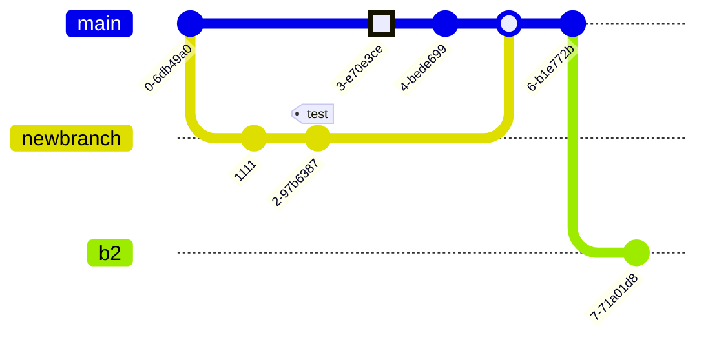

# Static Pages

This repository is for serving static content.

## Diagram Test

```mermaid
gitGraph:
    commit "Ashish"
    branch newbranch
    checkout newbranch
    commit id:"1111"
    commit tag:"test"
    checkout main
    commit type: HIGHLIGHT
    commit
    merge newbranch
    commit
    branch b2
    commit
```

## [Link Test](/Notes)

## References

- https://pages.github.com/
